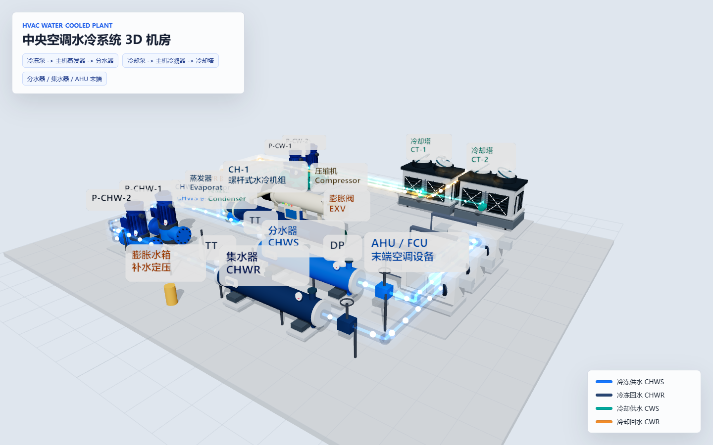

# 中央空调水冷系统 3D 机房

基于 Three.js / Vite 构建的中央空调水冷系统 3D 机房视图。场景保留地面、主机、冷冻泵、冷却泵、分水器、集水器、AHU/FCU 末端和两台冷却塔，取消墙体和天花板，便于观察设备关系和水流路径。

## 功能特点

- 水冷机组拆分展示蒸发器、冷凝器、压缩机、膨胀阀四大部件。
- 冷冻水系统与冷却水系统分色展示：
  - 冷冻回水 CHWR：集水器 -> 冷冻泵 -> 主机蒸发器。
  - 冷冻供水 CHWS：主机蒸发器 -> 分水器 -> AHU/FCU 末端。
  - 冷却供水 CWS：冷却塔 -> 冷却泵 -> 主机冷凝器。
  - 冷却回水 CWR：主机冷凝器 -> 冷却塔。
- 管道采用规整直角外侧管廊，并带半透明柔化效果与动态水流粒子。
- 冷却塔按矩形横流塔风格优化，包含顶置风机、进风百叶、X 支撑、集水盘和检修面板。

## 预览



## 本地运行

```bash
npm install
npm run dev
```

打开 Vite 输出的本地地址，默认可使用：

```text
http://127.0.0.1:5173/
```

## 构建

```bash
npm run build
```

## 文件结构

```text
.
├── index.html
├── styles.css
├── src/
│   └── main.js
├── docs/
│   └── hvac-threejs-room-desktop.png
├── package.json
└── README.md
```
