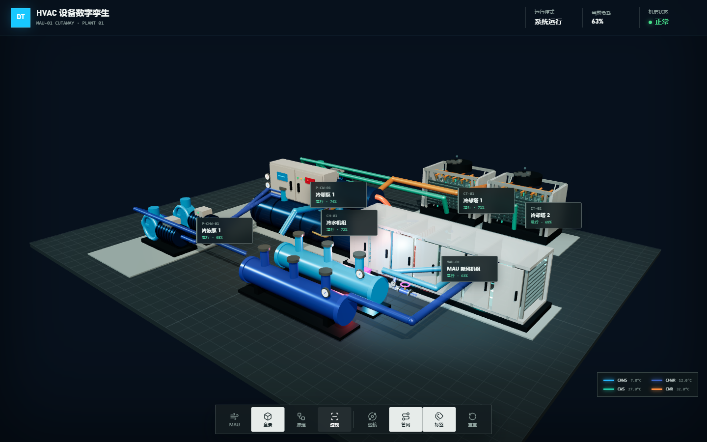
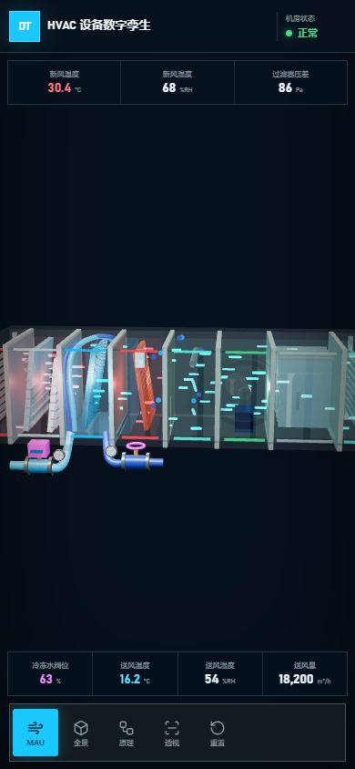
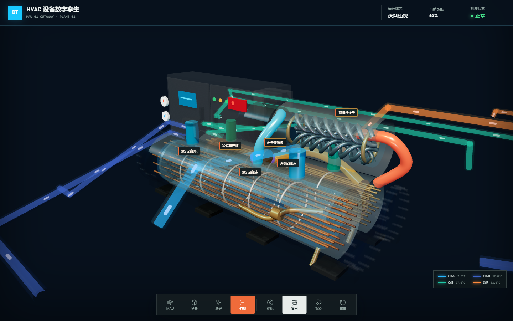
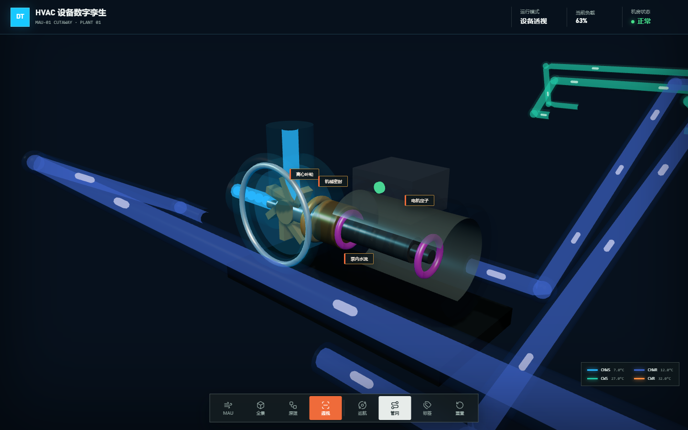
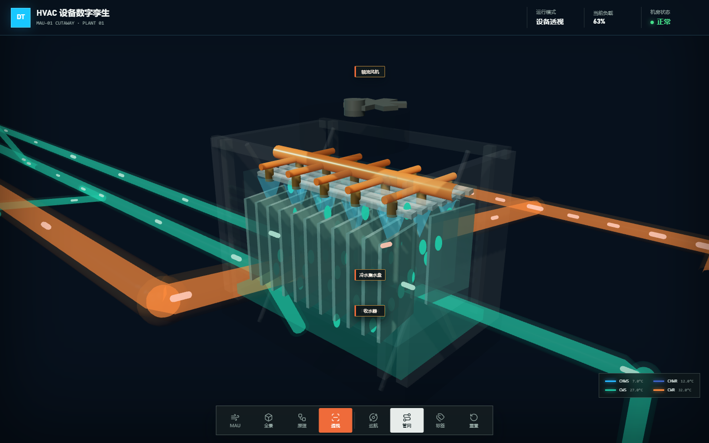

<meta name="author" content="yewwung">
<meta name="creator" content="yewwung">
<meta name="lastModifiedBy" content="yewwung">

# MAU 与中央空调系统 3D 数字孪生

基于 Three.js 与 Vite 构建的可交互暖通数字孪生展示。默认首屏直接进入 MAU-01 电影化剖视：透明外壳内显示过滤、盘管、加热、加湿和送风机，红/蓝/青粒子表现空气状态变化，冷冻水支路与阀组显示内部水流。完整机房、制冷原理和通用设备透视仍可一键切换。

初始版本未被覆盖，完整快照保存在 [`original/`](original/) 目录。

## 效果预览

### MAU 电影化剖视


### 全厂运行



### 移动端



### 冷水机组制冷原理


### 通用设备透视







## 主要能力

- 螺杆式水冷冷水机组按实际设备结构建模：双壳管换热器、铜管束、双螺杆转子、控制柜、电子膨胀阀、制冷剂回路、压力表、法兰和底座。
- MAU 新风机组提供电影化数字孪生剖视：84 个发光空气粒子以约 11–13 秒完成一次穿越，按防雨百叶、G4 初效、F8 中效、表冷除湿、再热、蒸汽加湿、送风机和消声送风顺序展开。
- 冷却盘管外露 CHWS 控制阀、CHWR 平衡阀、执行器、表计和四条内部/外部水流路径。
- 水泵可透视蜗壳水体、叶轮、轴、机械密封、轴承、电机定子和内部水路；冷却塔包含布水、喷淋锥、填料、收水器、盆水、下落水滴、上升气流和旋转风机。
- CHWS、CHWR、CWS、CWR 四类管网使用透明管壁、内部流芯和定向胶囊粒子，按真实方向运行。
- 制冷循环按压缩、冷凝、节流、蒸发顺序自动高亮，压缩机双螺杆持续旋转。
- 支持设备点选、镜头聚焦、自动巡航、管网/标签显隐、视角重置和响应式移动端抽屉。
- 所有运行值为本地确定性演示数据，可由宿主软件或实时接口替换。
- 当前设备由 Three.js 程序化构建；`src/scene/equipment/` 保持独立构建边界，后续可替换为 Blender 优化并导出的 GLB 模型。

## 本地运行

```bash
npm install
npm run dev
```

默认地址：

```text
http://127.0.0.1:5173/
```

构建与测试：

```bash
npm test
npm run build
```

## 软件嵌入 API

页面加载后会暴露 `window.HVACShowcase`：

```js
window.HVACShowcase.setMode("overview");
window.HVACShowcase.focusEquipment("MAU-01");
window.HVACShowcase.setXray(true);
window.HVACShowcase.resetView();

const state = window.HVACShowcase.getState();
```

支持的模式：

- `mau`：默认 MAU-01 电影化剖视、冷热气流、盘管水路与运行 HUD。
- `overview`：全厂设备、数据标签和动态管网。
- `principle`：隔离冷水机组，展示内部组件与四阶段制冷循环。
- `xray`：透视当前设备外壳，保留内部工作件和流体动画。

## 目录结构

```text
.
├── index.html
├── styles.css
├── src/
│   ├── app/                 # 状态、界面与嵌入 API
│   ├── data/                # 设备、流量和制冷循环数据
│   ├── scene/               # Three.js 场景、管网和设备模型
│   └── main.js
├── tests/                   # Node 结构与行为测试
├── scripts/                 # 生成截图的作者元数据工具
├── docs/                    # 实际浏览器截图和设计文档
└── original/                # 初始版本原样快照
```

## 原版运行

```bash
cd original
npm install
npm run dev
```
