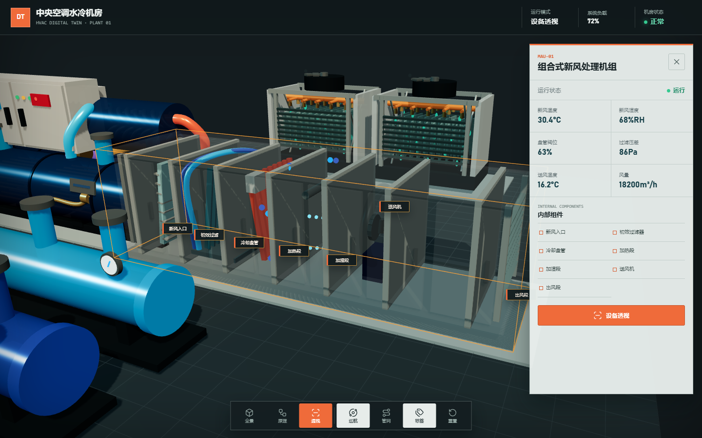
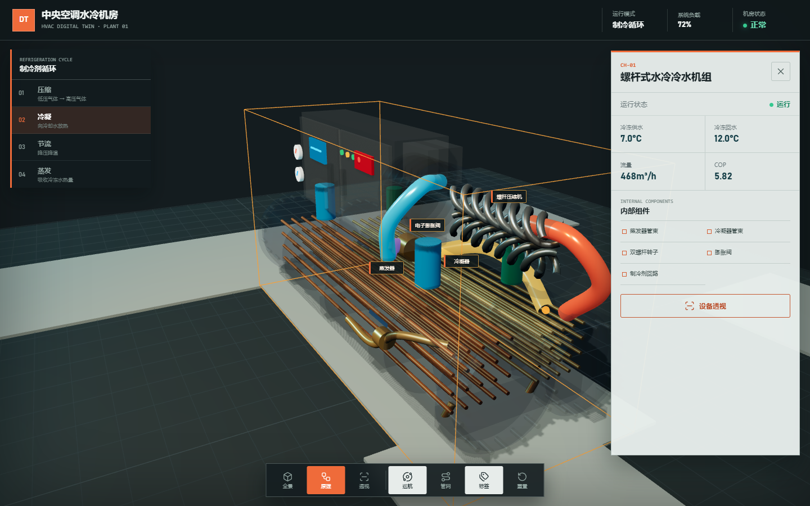

<meta name="author" content="yewwung">
<meta name="creator" content="yewwung">
<meta name="lastModifiedBy" content="yewwung">

# 中央空调水冷机房 3D 数字孪生

基于 Three.js 与 Vite 构建的可交互暖通数字孪生展示。页面直接进入全屏 WebGL 机房，可旋转、缩放、点选设备，并在全厂运行、制冷原理和设备透视三种模式之间切换。

初始版本未被覆盖，完整快照保存在 [`original/`](original/) 目录。

## 效果预览

### 全厂运行


### MAU 设备透视



### 冷水机组制冷原理



## 主要能力

- 螺杆式水冷冷水机组按实际设备结构建模：双壳管换热器、铜管束、双螺杆转子、控制柜、电子膨胀阀、制冷剂回路、压力表、法兰和底座。
- MAU 新风机组提供数字孪生剖视：新风入口、初效过滤、冷却盘管、加热、加湿、送风机和出风段按气流顺序展开。
- 水泵可透视叶轮、联轴器和内部水路；冷却塔包含布水、填料、下落水滴、上升气流和旋转风机。
- CHWS、CHWR、CWS、CWR 四类管网按真实方向运行，流量决定粒子速度。
- 制冷循环按压缩、冷凝、节流、蒸发顺序自动高亮，压缩机双螺杆持续旋转。
- 支持设备点选、镜头聚焦、自动巡航、管网/标签显隐、视角重置和响应式移动端抽屉。
- 所有运行值为本地确定性演示数据，可由宿主软件或实时接口替换。

## 本地运行

```bash
npm install
npm run dev
```

默认地址：

```text
http://127.0.0.1:5173/
```

构建与测试：

```bash
npm test
npm run build
```

## 软件嵌入 API

页面加载后会暴露 `window.HVACShowcase`：

```js
window.HVACShowcase.setMode("overview");
window.HVACShowcase.focusEquipment("MAU-01");
window.HVACShowcase.setXray(true);
window.HVACShowcase.resetView();

const state = window.HVACShowcase.getState();
```

支持的模式：

- `overview`：全厂设备、数据标签和动态管网。
- `principle`：隔离冷水机组，展示内部组件与四阶段制冷循环。
- `xray`：透视当前设备外壳，保留内部工作件和流体动画。

## 目录结构

```text
.
├── index.html
├── styles.css
├── src/
│   ├── app/                 # 状态、界面与嵌入 API
│   ├── data/                # 设备、流量和制冷循环数据
│   ├── scene/               # Three.js 场景、管网和设备模型
│   └── main.js
├── tests/                   # Node 结构与行为测试
├── scripts/                 # 生成截图的作者元数据工具
├── docs/                    # 实际浏览器截图和设计文档
└── original/                # 初始版本原样快照
```

## 原版运行

```bash
cd original
npm install
npm run dev
```
